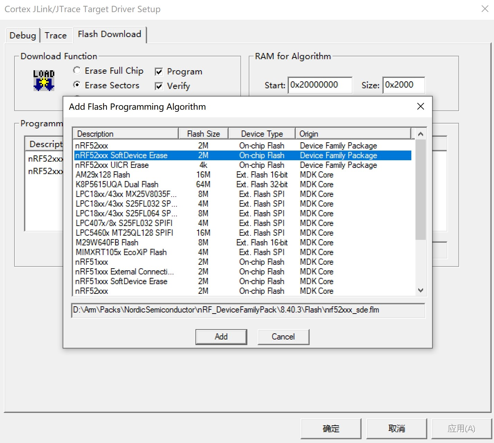
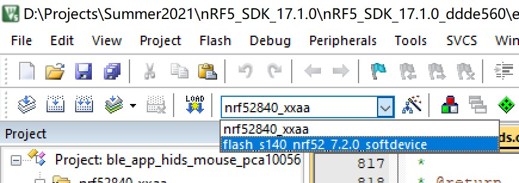
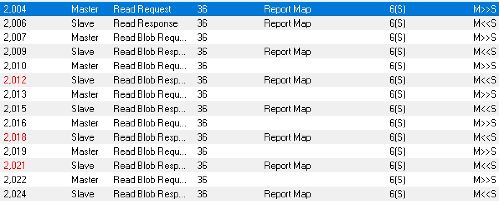

# 关于未完成的 HOGP

## 一、简介

HID over GATT Profile（HOGP），利用 LE 的基本协议 GATT 实现 HID Host 与 Device 的交互。

本项目目标是基于 BSAL 实现 HOGP，完成一个鼠标的 sample。

本项目目前开发使用的开发板是 PCA10056，BSAL 使用的协议栈是 Nimble。

## 二、参考

以 Nordic 官方 [nRF5_SDK_17.1.0](https://www.nordicsemi.com/Products/Development-software/nrf5-sdk/download) 中 \examples\ble_peripheral\ble_app_hids_mouse\pca10056\s140\arm5_no_packs 作参考。

相关文件已放在 Softdevice 文件夹内。

### 2.1 测试方法

打开官方 sdk 的 hid sample 工程，板子连接上之后，首先将板子完全擦除一遍。使用 sde 规则擦除芯片：

擦除完芯片后，将工程切换至 Softdevice 目标，并下载（不需要编译）：

下载完 Softdevice 后，再将工程目标切换为 nrf52840_xxaa ，编译并下载。此时，打开串口工具，按下板子的复位键，就能看到有打印信息出来。

打开电脑的蓝牙，搜索设备，连接板子（此时板子是一个鼠标设备）。连接成功后，按下板子的按键，电脑的鼠标就能上下左右移动了。

手机（安卓）同理，打开蓝牙，搜索设备，连接板子。连接成功后，按下板子上的按键，手机屏幕上便会出现一个鼠标，这个鼠标也会移动。

需要注意的是，有时候会出现怎么也连不上板子蓝牙的情况。这时候需要将板子擦除一次，并重新烧录文件。有可能是程序对上一次连接的设备做了记录，导致下一次就不能连接其他设备了。

### 2.2 抓包

利用手机进行了一次抓包，抓包文件在当前目录下的 btsnoop_hci_hid.cfa 文件。可以使用 Frontline 查看文件。具体抓包与查看文件[教程链接](https://supperthomas-wiki.readthedocs.io/en/latest/03_xupenghu/04_btsnoop_hci/android_hci.html)。

抓包的操作过程：首先擦除芯片，重新烧录文件。然后手机开启抓包模式，在设置->蓝牙里，连接上板子。逐一按下板子的四个按键，鼠标向上下左右四个方向移动了一点距离，抓包操作结束。

## 三、目前进度

### 3.1 sample 需要的各种 Service 的注册已实现

按照参考的工程，各种 Service 的注册已实现，包括 HID,BAS,DIS 等等。即目前手机连接上后，用 nRF Connect 看到的 Service 与参考工程的一致。但 Service 里的功能尚未实现。比如说 hid上传到 bsal 层的各种中断还没处理。

### 3.2 目前卡在发送数组（Report Map 特性）

#### 3.2.1 抓包的分析与结论

官方 sdk 中，有一个很长的配置用的数组（Report Map），用以告诉 host 一些配置信息。但是不是很清楚这个数组是何时、怎么发送过去的。分析抓包数据：

可以看到，第2004帧，host 端发送一个读请求，请求读取 Report Map 数据。之后，设备分七次将 Report Map 数据发送过去。

因此，这个数组是 hid 下的 Report Map 特性的一个值，当 host 请求读取 Report Map 特性值时，便要将数组发送过去。要实现的就是这个发送过程。

#### 3.2.2 手机请求读取 Report Map 数据时，没有中断传上来

手机用 nRF Connect 连接上设备后，读取 Report Map 特性无反应，调试发现读请求中断没有上传到 BSAL。

为了排除是服务、特性之间的影响，我只保留一个 Service 和一个特性，将其他全部注释掉（现在 bsal_srv_hid.c 便是如此）。发现 hid 服务下，除了几个特性以外，其他的特性的读、写请求中断均无法上传到 BSAL 层。

一开始怀疑是 BSAL 层某些部分未实现，尝试 debug 后发现，原来在 nimble 就已经没有中断上传上来了。不是 BSAL 的问题，便没有继续往 nimble 去 debug 了。

目前怀疑两个地方：一个是 nimble 的 rt-thread 接口部分会不会有 bug；一个是手机连接会不会有问题。

- 第一个，nimble 的 ops 函数会不会有问题，特别是注册 Service 的那条函数，以及 nimble 的读写中断向 BSAL 传时会不会有 bug。

- 第二个，在猜测有没有可能在连接时需要一些加密，或者验证等，才能继续后面读取 Report Map 操作。

项目未完，待续……